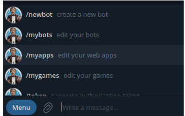
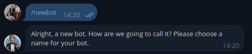
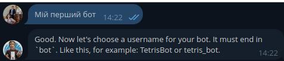
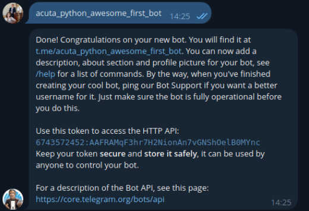

project "фільми goiteens": https://t.me/films_goiteens_bot

# Корисні посилання.
 - Aiogram: https://docs.aiogram.dev/uk-ua/dev-3.x/dispatcher/filters/magic_filters.html
 - Guide aiogram: https://mastergroosha.github.io/aiogram-3-guide/routers/
 - Decorators: https://tproger.ru/translations/demystifying-decorators-in-python
 - JSON: https://docs.python.org/uk/3/library/json.html#

# Створеня власного боту.

Перейдемо в Telegram і створимо власного бота. У пошуку потрібно вписати наступне: https://t.me/BotFather або @BotFather
Відкриваємо чат із першим верифікованим ботом(блакитна галочка)
Відкриваємо меню(Menu) і бачимо наступні елементи:

Якщо раніше вже створювали бота то можна його знайти за командою /mybots 
Інакше нам знадобиться команда /newbot

Далі вводимо назву вашого бота(наприклад “Мій перший бот”) та відправляємо повідомлення

Далі вводимо username(ім’я користувача) вашого бота. Обов’язково унікальне username та використовувати слово “bot” наприкінці username. Наприклад: “acuta_python_awesome_first_bot”. Після чого ви отримаєте повідомлення про успішне створення вашого бота

В цьому повідомленні є все необхідне:
‘You will find it at t.me/acuta_python_awesome_first_bot’ - це лінк який використовується вашим ботом
‘Use this token to access the HTTP API:
6743572452:AAFRAMqF3hr7H2NionAn7vGNShOelB0MYnc’ - Це токен для доступу до TelegramBot API

__Важливо! Нікому не передавайте та не демонструйте цей токен.__

Якщо бажаєте його оновити на інший за будь яких причин виконайте наступні кроки:
 - /mybots
 - Обираємо вашого бота
 - API Token
 - Revoke current token

